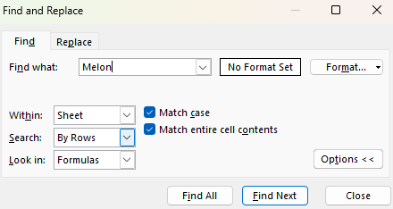

Excel-3

Excel-3 is a guide to Find & Select feature in Excel. Here you'll find practical tips, instructions, and illustrations about finding, replacing and removing values.

Table of Contents

Find

1. On the Home tab, in the Editing group, click Find & Select. (Or press CTRL+F)
2. Click Find.
   

The 'Find and Replace' dialog box will appear.
3. Type the text you want to find. For example, type Melon.

Excel selects the first occurrence.
4. Click Find next

5. To get a list of all the occurrences, click 'Find All'.
(Note: Excel highlighted Watermelon even though we wanted to search the word Melon. To only get exact match go to Options in Find and Replace dialog box and select Match entire cell contents. Checking Match case will make your search case-specific.)

Replace

1. On the Home tab, in the Editing group, click Find & Select.
2. Click Replace.
3. The 'Find and Replace' dialog will appear.
4. Type the text you want to find and replace it with.
5. Click Find Next.

6. Click Replace to make a single replacement.

(Note: use Replace All to replace all occurrences.)

Go To Special

Use Excel`s Go To Special feature to quickly select all cells with data validation, formulas, conditional formatting etc.
Here we select cells with formulas.

1. Select range of cells.
2. On the Home tab, in the Editing group, click Find & Select.
3. Click Go To Special.
4. Select Formulas and click OK.

Excel selects all cells with formulas.

Wildcards

There are 3 wildcards in Excel: ? matches exactly one character, * matches zero or more characters, ~ matches wildcards for example ~? finds a literal question mark.

Delete blank rows

1. On the Home tab, in the Editing group, click Find & Select.
2. Click Go To Special.
3. Select Blanks and click OK.

4. On the Home tab, in the Cells group, click Delete then Delete Sheet Rows 

Result:

(Note: this method also deletes rows with one or more blank cells.)

Now lets remove only rows that are completly empty.

Insert COUNTA function and drag it down.

When COUNTA returns 0 it means row is empty. We need to filter these rows.
Select cell E1.
On the Data tab, in the Sort & Filter group, click Filter. Arrows in column headers will appear.

Click the arrow in E1 column.
Click on Select All to clear all the check boxes, and click the check box next to 0.

Click OK.
Result: 

Delete these rows then click Filter again to remove it.
Result:

Row differences

1. Select range H1:J7
(Note: because we selected the range H1:J7 by clicking on cell H1 first, cell H1 is the active cell (Use ENTER and TAB to change the active cell). As a result, the comparison cells are in column H.)
2. On the Home tab, in the Editing group, click Find & Select.
3. Click Go To Special.
4. Select Row differences and click OK.

Result:

Colored differences:

   
